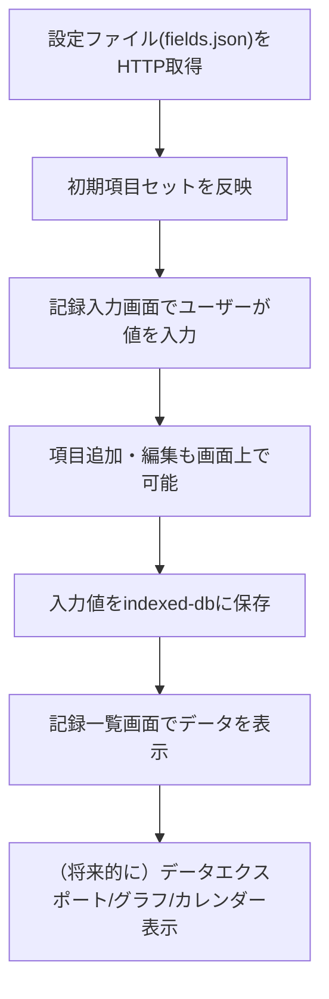

# アロエ健康管理ログ 要件定義・設計ドキュメント

**最終更新日:** 2025-07-21
**プロジェクト状態:** 実装完了（PWAアプリとしてリリース済）

---

## 1. 要件定義

### 入力データ

- 要望 ID 　　　：REQ-1234
- タイトル　　 ：ダイエット・健康管理アプリの作成
- 概要　　　　：体重、血圧、日課記録などを毎日記録できるPWAアプリ。MobX状態管理、IndexedDBストレージ、グラフ表示、JSONエクスポート機能を実装済み。

### リポジトリ静的解析 & 影響箇所推定

- 実装済み画面
  - 体重記録画面：グラフ表示、目標進捗管理
  - 日課記録画面：運動、食事、睡眠、喫煙、飲酒の記録
  - 血圧記録画面：最高・最低血圧、心拍数の記録
  - グラフ表示画面：時系列データの可視化
  - 目標設定画面：体重目標、個人情報管理
  - データエクスポート画面：JSON形式でのダウンロード
- クラス・メソッド
  - 記録データ管理（indexed-db への保存・取得・削除）
  - 項目追加・編集ロジック
- DB テーブル
  - indexed-db スキーマ（ユーザー定義の項目、記録値、日時、運動有無など）

### 要件ジャッジ

- やるべきか？：Yes
- 優先度：高
- 影響範囲メモ：
  - 新規画面・機能の追加
  - 柔軟なデータスキーマ設計（項目追加・編集対応）
  - indexed-db を用いたローカルデータ管理
  - UI/UX 設計（項目追加のしやすさ重視）
- 判断理由 or 追加ヒアリング事項：
  - 健康管理のための柔軟な記録機能は多様なユーザーに有用
  - 記録項目の自由度や、運動有無などの非数値データも対応
  - グラフやカレンダー表示は将来的な拡張として考慮
  - バックエンドは不要、完全クライアントサイドで完結

---

## 2. 詳細設計 ― 方針作成

### 変更対象ファイル・関数

- src/pages/RecordInput.tsx
- src/pages/RecordList.tsx
- src/store/records.ts
- src/db/indexedDb.ts
- src/components/CustomFieldManager.tsx
- src/types/record.ts
- src/config/fields.json

### データ設計方針

- 記録データは「縦持ち」スキーマで管理
  - 各レコード：{ id, date, time, datetime, fieldId, value }
  - 1 回の記録で複数項目が入力される場合、項目ごとにレコードを分割
- 記録項目（フィールド）は別テーブルで管理
  - { fieldId, name, unit, type (number/string/boolean), default }
- 設定ファイル（fields.json）は HTTP 経由で取得し、初期項目セットやテンプレートを提供
- ユーザーは項目を自由に追加・編集可能
- 単位も項目ごとに設定可能
- 運動有無・食事有無・睡眠有無なども他の項目と同様に「縦持ち」で管理

### 画面設計方針

- 記録入力画面で、項目の追加・編集・選択が簡単にできる UI
- 記録一覧画面で、日付・時刻ごとに記録をグループ化して表示
- 初期項目セット（体重、血圧、運動有無、食事有無、睡眠有無）は fields.json から自動反映
- 設定ファイルの再取得やリロード機能も検討

### 設定ファイル・データ取得

- 設定ファイル（fields.json）はデプロイ元サーバー等から HTTP で取得
- より良い方法があれば、例えば PWA のアセットとしてバンドルや、ユーザーによるアップロードも検討

### データエクスポート

- **✅ 実装済み:** JSON 形式でのデータエクスポート機能

### TypeScript 設計

- date, time, datetime は分けて管理
  - date: "YYYY-MM-DD"
  - time: "HH:mm"
  - datetime: ISO8601 文字列
- レコード型例：

  ```ts
  type Record = {
    id: string;
    date: string; // "2024-06-01"
    time: string; // "08:00"
    datetime: string; // "2024-06-01T08:00:00"
    fieldId: string;
    value: number | string | boolean;
  };
  ```

### 初期項目セット例（fields.json イメージ）

```json
[
  { "fieldId": "weight", "name": "体重", "unit": "kg", "type": "number" },
  {
    "fieldId": "blood_pressure",
    "name": "血圧",
    "unit": "mmHg",
    "type": "string"
  },
  {
    "fieldId": "exercise",
    "name": "運動有無(通勤時の早歩き)",
    "unit": "",
    "type": "boolean"
  },
  {
    "fieldId": "meal",
    "name": "食事有無(80kcal減)",
    "unit": "",
    "type": "boolean"
  },
  {
    "fieldId": "sleep",
    "name": "睡眠有無(0時までに寝る)",
    "unit": "",
    "type": "boolean"
  }
]
```

---

## 3. レビュー＆ブラッシュアップ

### 処理フロー (mermaid)



### 開発工数見積

| タスク                      | 工数目安（h） |
| --------------------------- | :-----------: |
| 設定ファイル設計・HTTP 取得 |       4       |
| 記録入力画面 UI/ロジック    |       8       |
| 記録一覧画面 UI/ロジック    |       6       |
| 項目追加・編集 UI/ロジック  |       6       |
| indexed-db 連携             |       6       |
| MobX ストア設計            |       3       |
| 型定義・バリデーション      |       3       |
| テスト・デバッグ            |       4       |
| ドキュメント整備            |       2       |
| **合計**                    |    **42h**    |
| **人日換算（1 日 7h）**     |  **約 6 日**  |

### ✅ 実装済み機能一覧

**コア機能**
- ✅ 体重記録とグラフ表示（BMI計算、目標進捗管理）
- ✅ 日課記録（運動、食事、睡眠、喫煙、飲酒）
- ✅ 血圧記録（最高・最低血圧、心拍数）
- ✅ グラフ・チャート表示（Recharts使用）
- ✅ JSON形式データエクスポート

**技術スタック**
- ✅ React 18 + TypeScript + Vite
- ✅ MobX 状態管理（Zustandから移行済み）
- ✅ IndexedDB + Repositoryパターン
- ✅ Tailwind CSS + Headless UI
- ✅ PWA対応（オフライン機能）
- ✅ GitHub Pages デプロイ

**UI/UX機能**
- ✅ レスポンシブデザイン（モバイルファースト）
- ✅ ダークモード未対応（将来的に実装予定）
- ✅ アクセシビリティ強化済み
- ✅ 日付ピッカー（カレンダー表示）

### ✅ 解決済み事項

- ✅ 記録項目：体重、血圧、日課記録を実装済み
- ✅ データエクスポート：JSON形式で実装済み
- ✅ 状態管理：MobXで実装済み
- ✅ グラフ表示：Rechartsで実装済み

### 今後の拡張予定

- カレンダー表示機能
- 記録項目のユーザーカスタマイズ
- データインポート機能
- ヘルスケアデータの統計分析
- ダークモード対応

---

## 4. ドキュメントアウトプット

### プロジェクトルール抜粋

- 記録項目は可変・ユーザー追加可能
- データは indexed-db に保存し、バックエンドは持たない
- 設定ファイル（fields.json）は HTTP 経由で取得
- 初期項目セットは体重・血圧・運動有無・食事有無・睡眠有無
- 将来的な拡張（グラフ・カレンダー・エクスポート等）を考慮

### 要件ジャッジ結果

- やるべきか？：Yes
- 優先度：高
- 影響範囲：新規画面・データスキーマ・UI/UX 設計
- 判断理由：健康管理のための柔軟な記録機能は多様なユーザーに有用

### 変更対象ファイル・関数リスト

- src/pages/RecordInput.tsx
- src/pages/RecordList.tsx
- src/store/records.ts
- src/db/indexedDb.ts
- src/components/CustomFieldManager.tsx
- src/types/record.ts
- src/config/fields.json

### データ設計の概要

- 記録データは「縦持ち」スキーマ
- 各レコード：{ id, date, time, datetime, fieldId, value }
- 記録項目（fields）は別テーブルで管理
- 設定ファイルは HTTP 経由で取得し、初期項目セットやテンプレートを提供
- ユーザーは項目・単位を自由に追加・編集可能

### 画面設計の概要

- 記録入力画面で項目の追加・編集・選択が簡単にできる UI
- 記録一覧画面で日付・時刻ごとに記録をグループ化して表示
- 初期項目セットは fields.json から自動反映

### アプリケーション処理フロー


### 開発工数の見積

- 合計：約 42h（約 6 人日）

### 未確定事項 & TODO

- [要確認] 記録項目の初期セットやテンプレートの詳細内容
- [要確認] 設定ファイルの取得先・更新タイミング
- [要確認] データエクスポートのフォーマット詳細
- [要確認] バリデーションや入力制限の詳細要件
